# Flow Diagrams and Designs

Below is an updated architecture package for the current AI Trader system.

This version is aligned to the code paths that are actively used today, especially:

- `scripts/collect_ticks.py`
- `backend/app.py`
- `scripts/tick_replay_backtest.py`
- `models/predict.py`
- `models/strategy_models.py`
- `models/rl_exit_agent.py`
- `dashboard/app/*`

Important alignment note:

- The current primary runtime is a **paper-trading / research system**
- Live market data, backtesting, model training, and dashboarding are active
- Zerodha execution modules exist in the repo, but they are **not the main active path**
- The main backend flow currently ends in **trade suggestions + paper positions + monitoring**, not exchange execution

# 1. Current High-Level Architecture

Core idea:

The system has two main worlds:

```text
Offline Research Layer (training + replay backtests)

Live Paper-Trading Layer (real-time scanning + monitoring + dashboard)
```

Current top-level system flow:

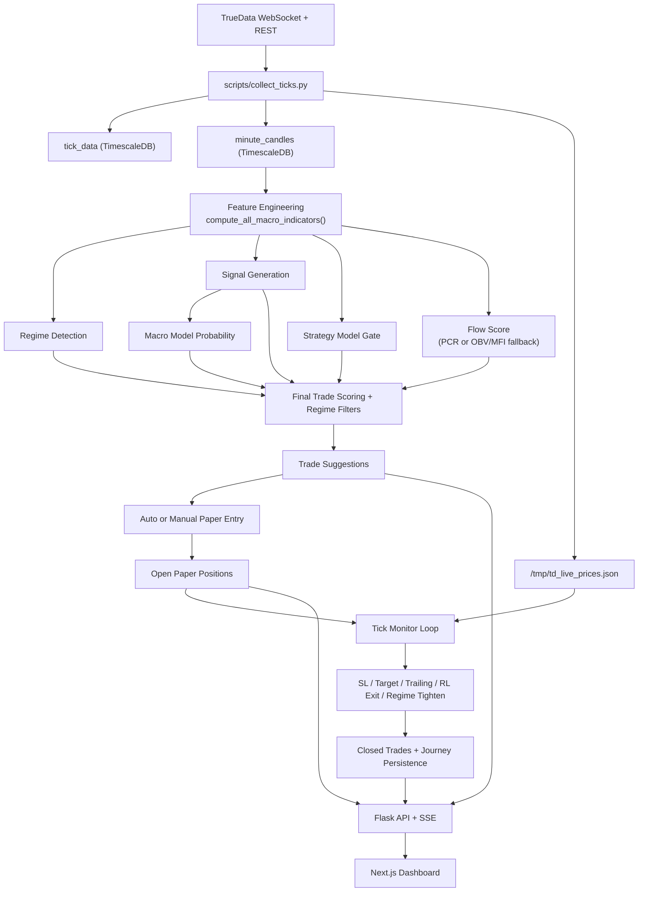

# 2. Data Pipeline Architecture

This diagram focuses on what the data layer does today.

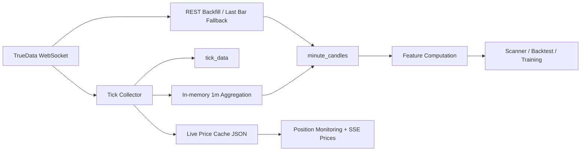

Purpose:

| Component | Current role |
| --- | --- |
| Tick Collector | captures live futures + option ticks |
| Minute Aggregation | builds and upserts 1-minute candles |
| Live Price Cache | shares freshest prices with Flask |
| REST Backfill | fills stale/missing market data |
| Feature Computation | derives macro indicators for scan/backtest/train |

# 3. Current Model Training Pipeline

This is the offline training path that matches the current scripts and saved models.

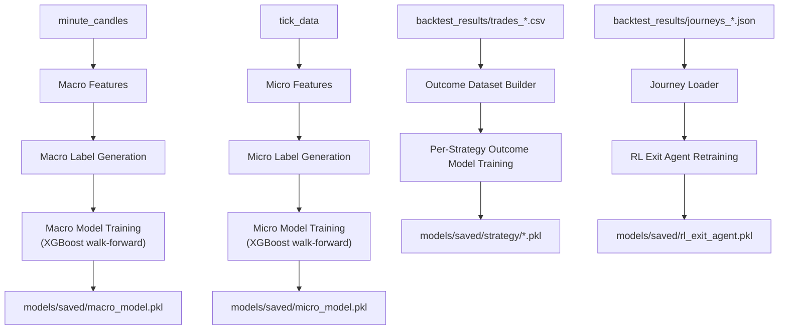

Training loop:

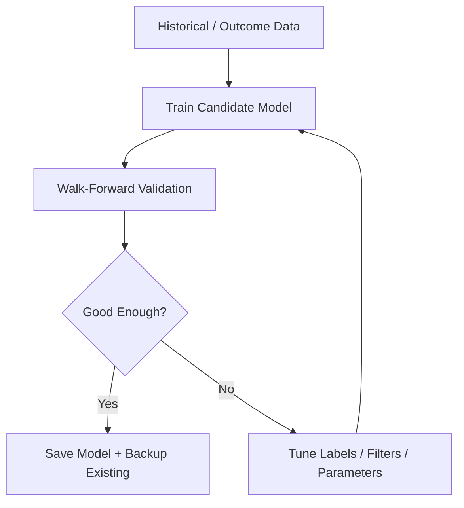

# 4. Current Live Paper-Trading Execution Pipeline

This is the primary active runtime path in `backend/app.py`.

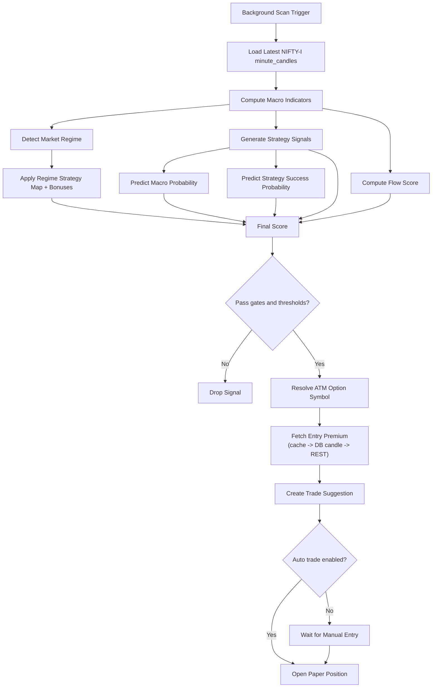

# 5. Position Monitoring and Exit Logic

This is the active trade-management path in the Flask backend.

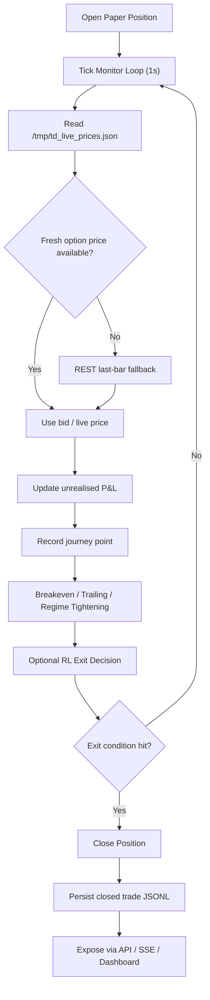

Current exit sources:

```text
SL_HIT
TARGET_HIT
TRAILING_SL
RL_EXIT
TIMEOUT
EOD_CLOSE
```

# 6. Current Decision Engine Logic

Scoring logic as implemented today:

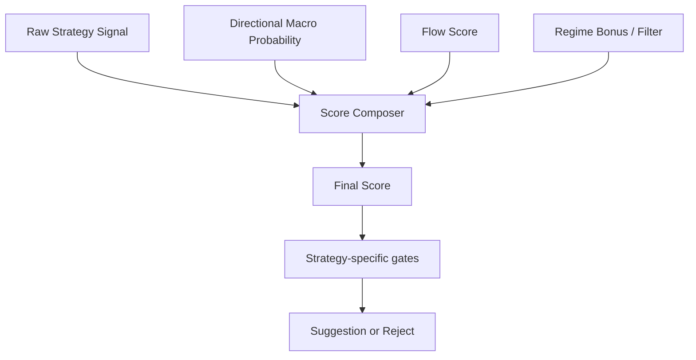

Primary score formula:

```text
final_score =
0.5 * directional_prob
+ 0.3 * flow_score
+ 0.2 * technical_strength
+ regime_bonus
```

Important current behavior:

- `strategy_prob` is used mainly as a **gate**, not as a weighted score term
- PUT directional confidence is computed as `1 - ml_prob`
- regime-specific thresholds are looser/tighter depending on market regime
- some strategies have extra regime restrictions before they are allowed through

# 7. Current Backtesting Architecture

This aligns with `scripts/tick_replay_backtest.py`.

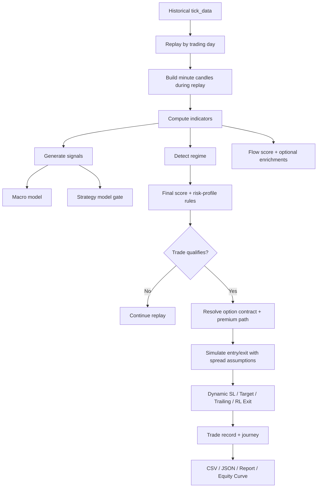

Metrics produced today:

```text
Trade list
P&L
Win rate
Profit factor
Avg win / avg loss
Equity curve
Journey traces per trade
```

# 8. Current Low-Level Architecture (LLD)

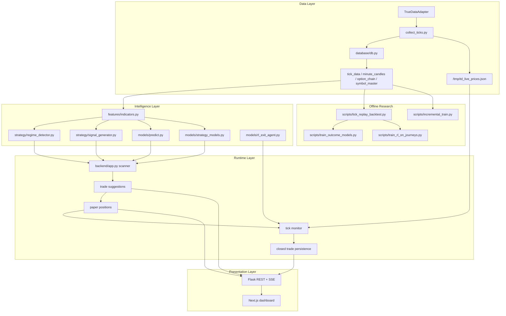

# 9. Service-Level Architecture

If the current system is further modularized, this is the split that best matches the current codebase.

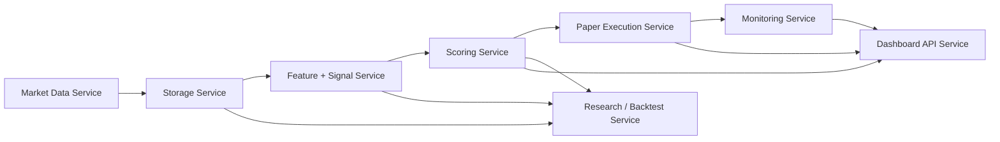

# 10. Current Storage Design

### Tick Data

```text
tick_data

timestamp
symbol
price
volume
oi
bid_price
ask_price
bid_qty
ask_qty
```

### Minute Candles

```text
minute_candles

timestamp
symbol
open
high
low
close
volume
vwap
oi
```

### Options / Symbol Metadata

```text
option_chain
symbol_master
```

### Trade Outputs

```text
trade_log                  # DB-level trade history / backtest usage
paper_trades/*.jsonl       # persisted Flask paper trades
backtest_results/*.csv
backtest_results/*.json
backtest_results/journeys_*.json
```

### Model Artifacts

```text
models/saved/macro_model.pkl
models/saved/micro_model.pkl
models/saved/strategy/*.pkl
models/saved/rl_exit_agent.pkl
models/saved/backups/YYYYMMDD/*
```

# 11. Actual Project Runtime Loop

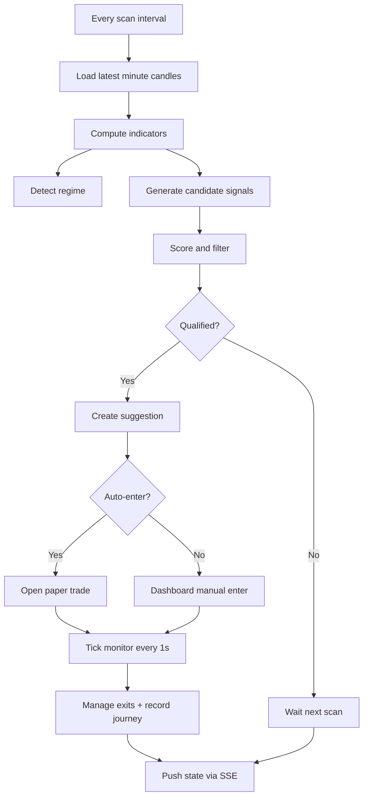

Current cadence:

```text
Scanner: ~30 to 60 seconds depending on path
Tick monitor: 1 second
Live cache flush: 1 second
Journey capture: ~5 seconds
```

# 12. Dashboard and API Flow

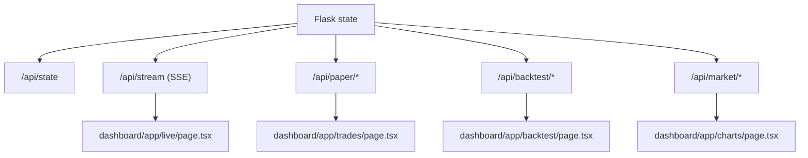

# 13. Optional / Secondary Paths in the Repo

These exist in the repo but are not the primary current system path:

```text
execution/order_manager.py
execution/broker_adapter.py
models/dqn_exit_agent.py
models/model_registry.py
main.py live execution path
```

They should be treated as optional or future-facing unless the runtime is explicitly switched to them.

# 14. Final Current System Summary

The current AI Trader system is best described as:

```text
Live TrueData ingestion
+ minute-candle feature pipeline
+ rule-based strategy generation
+ ML scoring and strategy gating
+ RL-assisted paper-trade exits
+ tick-replay backtesting
+ dashboard-driven monitoring
```

That is the architecture the Mermaid diagrams in this document now reflect.
