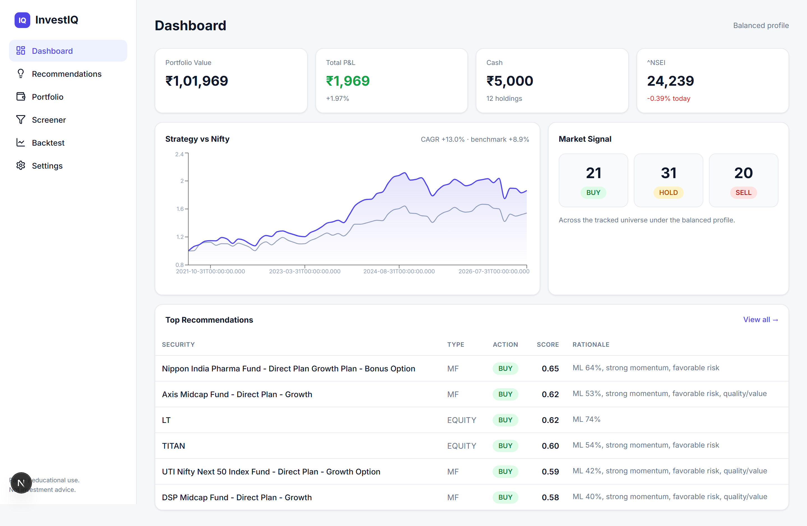
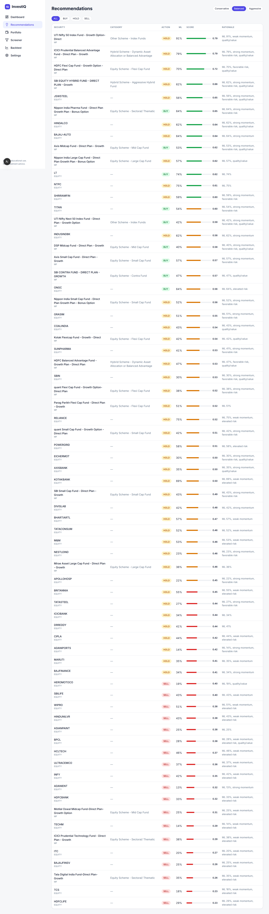
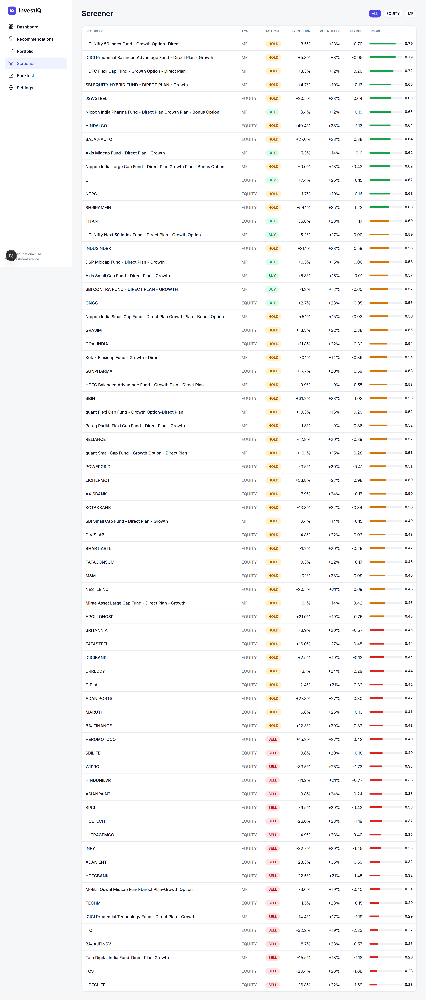
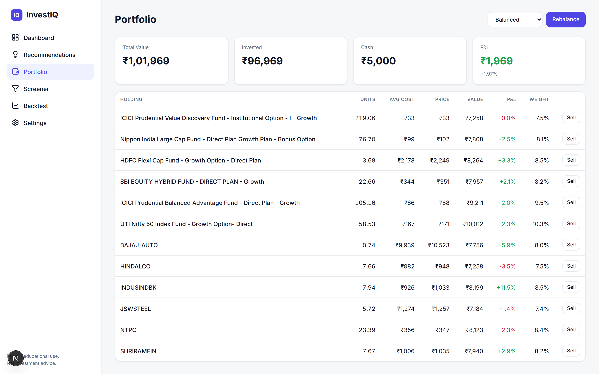
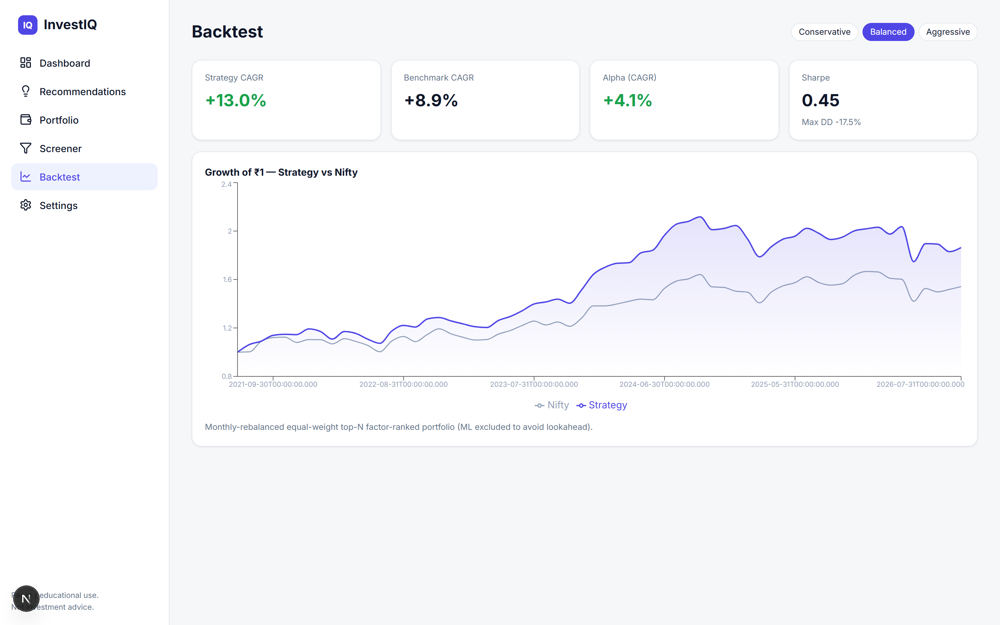
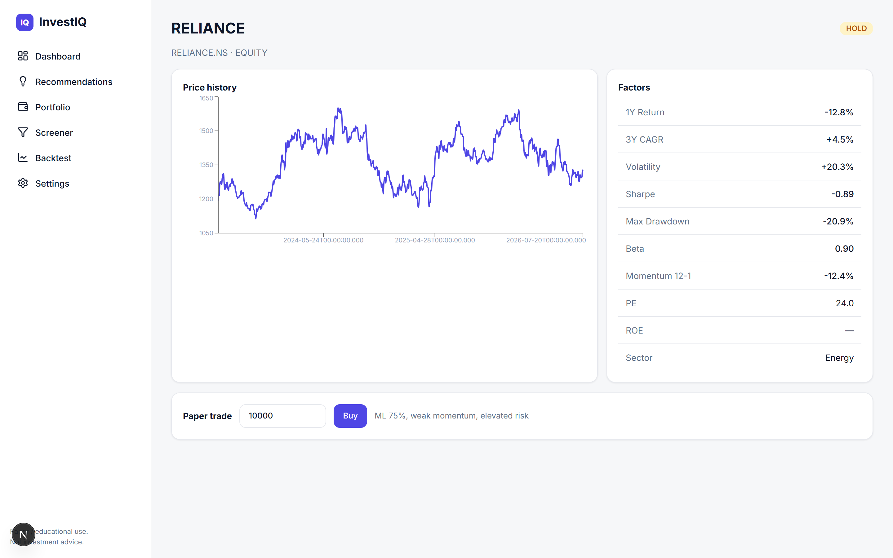
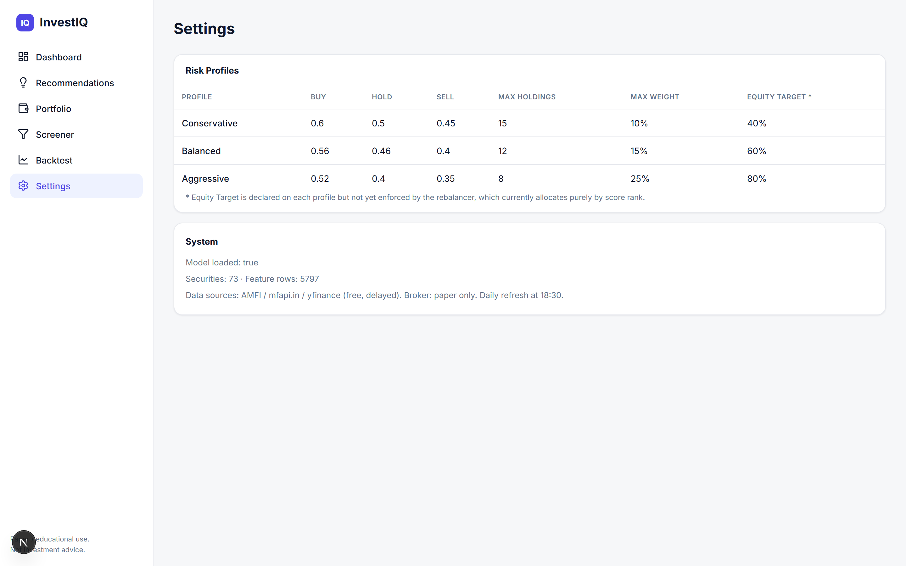

# InvestIQ

AI-assisted **mutual-fund + equity investing advisor** (India) — long-term BUY/HOLD/SELL signals and
a simulated (paper) portfolio. Built as an additive module inside this repo; it does not touch the
existing trading app.

- **Domain:** investing (daily / EOD cadence), not intraday trading.
- **Data:** free / delayed sources — AMFI NAV, [api.mfapi.in](https://www.mfapi.in/), `yfinance`.
- **ML:** XGBoost classifier predicting forward outperformance vs benchmark (walk-forward validated).
- **Action scope:** paper portfolio now, with a broker-adapter seam for real execution later.

> ⚠️ Educational / personal-use. Not investment advice.

## Layout (target)

```
investiq/
├── config/      settings.py, risk_profiles.py
├── utils/       logger.py
├── data/        amfi_adapter.py, mfapi_adapter.py, yfinance_adapter.py, refresh.py, mock_data.py
├── database/    db.py, schema.sql
├── features/    factor_engine.py
├── models/      train_model.py, predict.py, recommender.py
├── strategy/    scorer.py, recommendation_engine.py
├── portfolio/   paper_portfolio.py, rebalancer.py, broker_adapter.py
├── backtest/    backtest_engine.py
├── backend/     app.py
└── main.py      modes: mock | ingest | train | backtest | recommend | serve
```

## Screenshots

Live captures of the InvestIQ dashboard (Next.js on `:3001`, backed by the Flask API on `:5055`)
running against the seeded universe.

### Dashboard — portfolio value, strategy-vs-Nifty curve, market signal & top picks


### Recommendations — ranked BUY/HOLD/SELL with ML probability and rationale


### Screener — full scored universe with risk-profile and filter controls


### Portfolio — holdings, P&L, weights and one-click rebalance


### Backtest — monthly-rebalanced factor strategy vs Nifty (CAGR, alpha, Sharpe, drawdown)


### Security detail — price history, factor breakdown and paper-trade entry


### Settings — risk-profile thresholds and system status


## How to run

See [`docs/LEARNING.md`](docs/LEARNING.md#14-how-to-run--operate-it) for the full setup. In short
(from `investiq/`, with the TimescaleDB container up on host port 5440):

```bash
PYTHONUTF8=1 <python> main.py ingest      # pull the universe from free sources
PYTHONUTF8=1 <python> main.py train       # build features + train the model
PYTHONUTF8=1 <python> backend/app.py      # Flask API on :5055 (+ daily scheduler)
cd frontend && npm install && npm run dev -- -p 3001   # dashboard on :3001
```
